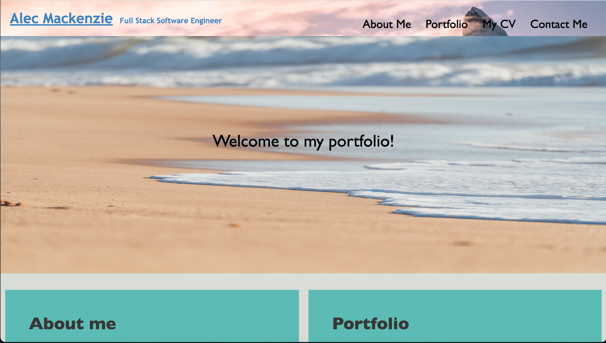

# alec-mackenzie-portfolio

## Description

For this project, I was assigned to design a portfolio webpage that navigates easily to different sections that contain an About Me, Portfolio of a collection of applications I have designed (with links to those applications), and a Contact Me section. 

My motivation for this project was to further my web development skills as well as showcase myself as a web developer. 

This project solves the problem of not having an accessible Portfolio page as a web developer.

I learned how to do many important HTML and CSS tasks, and most importantly how to construct a flex-box.

## Installation

To install this project you simply need to be able to access a Google Chrome browser window and have a reliable internet connection. 

Open a browser window, copy and past this link (https://amackenzie26.github.io/alec-mackenzie-portfolio/) into the URL section, and view the webpage upon loading. 

## Usage

The navigation bar at the top of the page successfully directs you to the content:

  
    Click on App 1, App 2, App3, or App4 to be redirected to their site (github repo for now)
 
 
    
## Credits

Thank you for assistance from BCB, pexels.com, W3schools.com, stackoverflow.com

## Links

Github Repo: https://github.com/amackenzie26/alec-mackenzie-portfolio
URL: https://amackenzie26.github.io/alec-mackenzie-portfolio/
